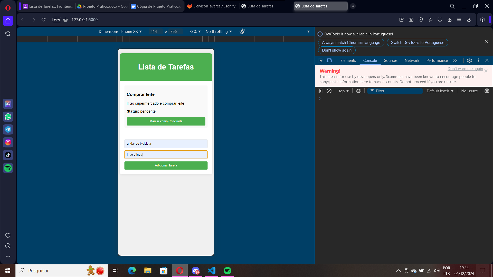
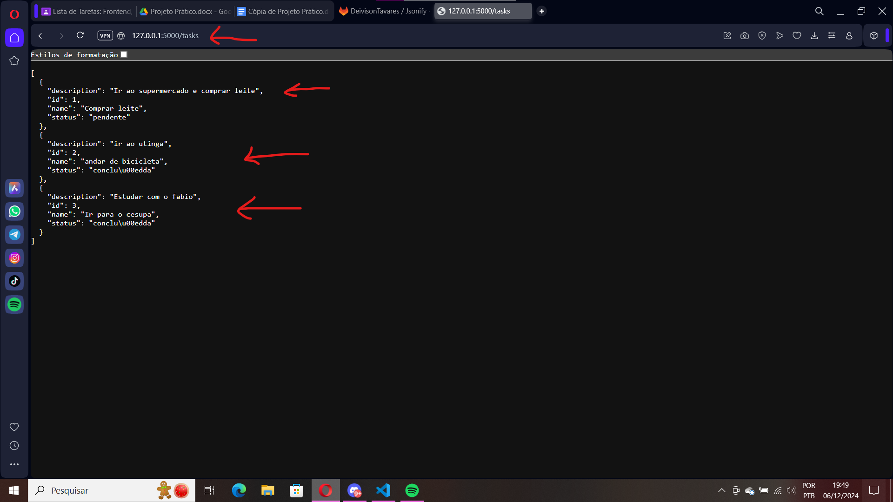

# Aplicativo de Lista de Tarefas - To-Do List

**Aluno: Deivison Ryan Brito Tavares**

## Descrição do Projeto
Utilizar a porta localhost,no caso http://127.0.0.1:5000

# Dificuldades Enfrentadas
Durante o desenvolvimento deste projeto, enfrentei dificuldades ao utilizar React para o frontend, pois só tinha experiência com o ambiente de programação Expo site. Não consegui implementar o frontend conforme inicialmente solicitado, então optei por utilizar HTML e CSS para tentar amenizar a situação e atender à parte da interface de forma funcional. Apesar disso, consegui implementar a comunicação entre o frontend e o backend utilizando Flask.

Este é um projeto de uma aplicação de lista de tarefas (To-Do List), que implementa as partes de **Frontend**, **Backend** e **Comunicação via API**. O objetivo é permitir que o usuário visualize, adicione e gerencie tarefas, com a interação entre o frontend (HTML/CSS) e o backend (Flask). 

O aplicativo segue a arquitetura de uma API RESTful para facilitar a comunicação entre o frontend e o backend, utilizando **requisições HTTP** para manipulação de dados.

## Funcionalidades

- **Visualização de Tarefas**: Exibe a lista de tarefas armazenadas no servidor, mostrando o nome, descrição e o status (pendente ou concluída).
- **Adicionar Tarefas**: Permite ao usuário adicionar novas tarefas à lista através de um formulário.
- **Alterar Status das Tarefas**: O usuário pode marcar uma tarefa como concluída ou pendente.

## Tecnologias Utilizadas

- **Frontend**:
  - HTML
  - CSS
  - JavaScript (JQuery)
  
- **Backend**:
  - Python
  - Flask
  - Flask-CORS (para permitir requisições entre o frontend e o backend)

- **Comunicação via API**:
  - API RESTful
  - Requisições HTTP (GET, POST e PUT)
  - Formato de dados JSON

- **Como funciona a comunicação entre o frontend e o backend**
O frontend faz requisições HTTP (usando JQuery) para o backend:<br>
-GET http://127.0.0.1:5000/tasks: Recupera todas as tarefas armazenadas no servidor.<br>
-POST http://127.0.0.1:5000/tasks: Envia uma nova tarefa para ser armazenada no servidor.<br>
-PUT http://127.0.0.1:5000/tasks/<task_id>: Atualiza o status da tarefa para "concluída" ou "pendente".<br>

## Como Rodar o Projeto

### Backend (Flask)

1. **Instalar dependências**:
   
   Primeiro, instale o Flask e o Flask-CORS:

   ```bash
   pip install Flask flask-cors
   
2. **Rodar o codigo**

    ```bash
    python app.py ou clicar no run python file

## Evidências

- 1 evidência:
Quando o app inicia ele terá um exemplo de coisa na lista para fazer isso SETado em um JSON tasks(tarefas):


- 2 eviências:
Terminal do VScode logo após o a inicialização do projeto


- 3 eviências:
Adicionando uma tarefa nova e uma descrição para a tarefa


- 4 eviências:
Tarefa e a descrição da evidência de numero 3 adicionadas ao sistema. As strings viram um objeto JSON e a evidência está no console do navegador com todos seus status


- 5 eviências:
Status da tarefa de ir ao utinga estava pendente e quando cliquei no botão que antes estava 'Marcar como concluida' ela é atualizada por meio do PUT,assim deixando de ter status Pendente e agora tendo status Concluido. OBS: o console do navegador mostra a atualização de status


- 6 eviências:
Nova tarefa "ir para o cesupa" adicionada,inicialmente ela chega como "Pendente",mas decidi atualizar ela para "Concluída" para melhor demonstração. E também para mostrar que dá para adicionar mais tarefas a lista.


- 7 eviências:
Demonstração do terminal do VS Code para mostrar as requisições HTTP GET(ler info),POST(mandar info) e PUT(atualizar info).


- 8 eviências:
Mostrando a requisição HTTP GET da rota http://127.0.0.1:5000/tasks com a demonstração dos JSON inseridos por meio dos inputs(POST) e atualizações(PUT) no sistema
